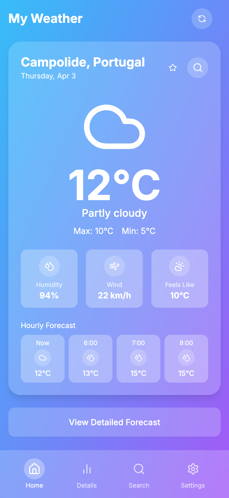
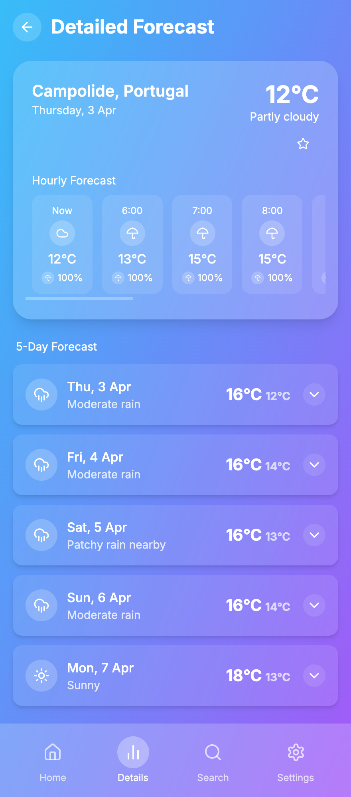
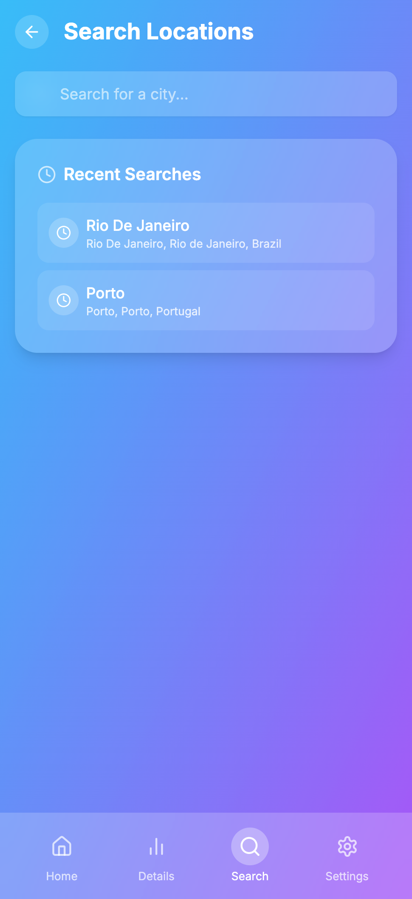
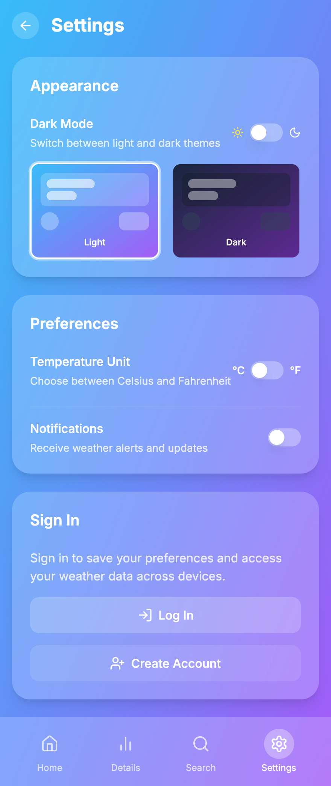
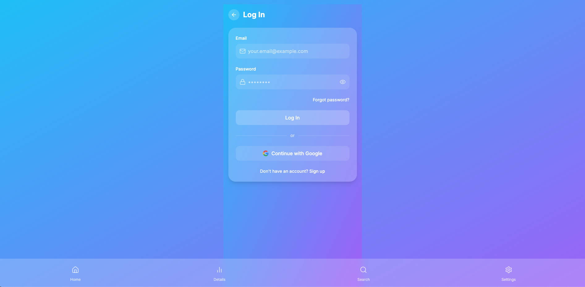
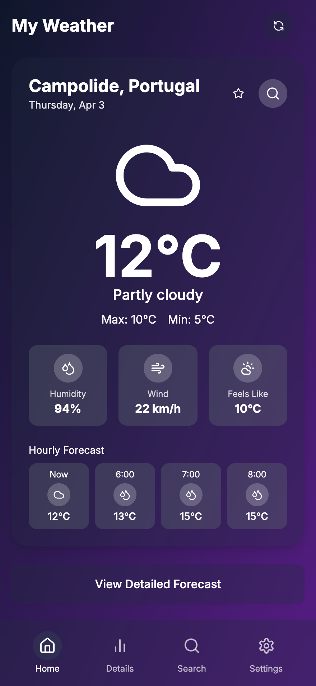
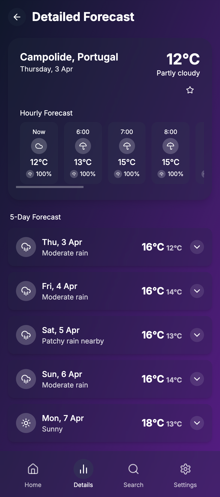
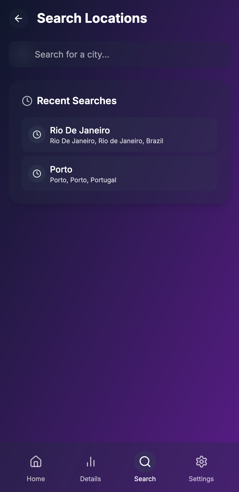
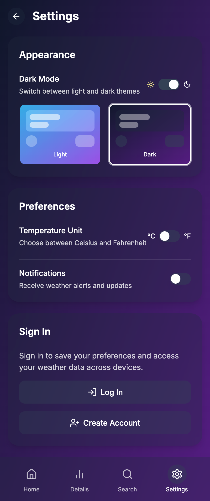
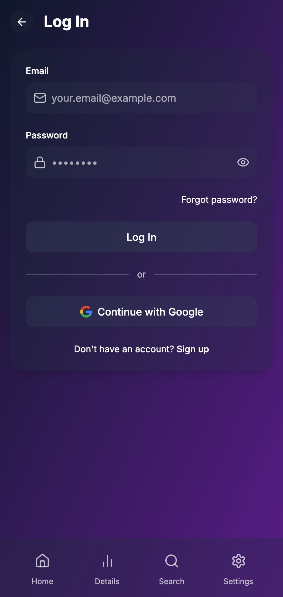

# MyOwnWeather v2 🌤️


## 📌 Project Overview

**Project Name:** "MyOwnWeather v2"

## 🌟 Preview

### Light Mode







### Dark Mode







**MyOwnWeather-v2** is a weather app that fetches and displays current weather data. In this version, I focused on improving the overall design, usability, and performance from MyOwnWeather (v1). By leveraging modern front-end practices and integrating AI suggestions via v0.dev, this app provides a clean and responsive interface.

## Motivation

After building the original version of MyOwnWeather (v1) using VSCode, I recognized the need for a more polished UI and better user experience. I experimented with v0.dev to generate an improved interface, then iterated on the result by hand using tools like Cursor and VSCode. This project serves as a testament to my growth as a front-end developer and my commitment to continuously improving my work.

---

## Recent Improvements

- **Enhanced Dark Mode**: Optimized dark theme with appropriate contrast and color schemes for all components
- **Consistent UI**: Unified styling across all pages including authentication screens
- **Improved Scrollbars**: Custom styled scrollbars that respect theme changes and don't interfere with navigation
- **Authentication Flow**: Streamlined login, signup, and password reset processes with consistent design
- **Visual Feedback**: Better loading states, animations, and user interaction responses
- **Accessibility**: Improved focus states and contrast for better usability

---

## Features

- Real-time weather data with WeatherAPI API
- Current weather conditions display
- Hourly and daily forecasts
- Location search functionality
- Geolocation support
- User accounts with favorites management
- Responsive design for all devices
- Dark/light mode theme support
- Smooth animations with Framer Motion
- Firebase authentication and data storage

---

## Tech Stack

- Next.js 14 (App Router)
- TypeScript
- TailwindCSS
- Framer Motion for animations
- shadcn/ui components
- Lucide React icons
- WeatherAPI
- Firebase (Authentication, Firestore)
- React Context API
- Client-side and server-side rendering

---

## Getting Started

### Prerequisites

- Node.js 18.17 or later
- npm or pnpm package manager

### Installation

1. Clone the repository

   ```bash
   git clone https://github.com/your-username/weather-app.git
   cd weather-app
   ```

2. Install dependencies

   ```bash
   npm install
   # or
   pnpm install
   ```

3. Create a `.env.local` file in the root directory with your API keys:

   ```
   NEXT_PUBLIC_WEATHER_API_KEY=your_api_key_here
   NEXT_PUBLIC_FIREBASE_API_KEY=your_firebase_api_key
   NEXT_PUBLIC_FIREBASE_AUTH_DOMAIN=your_firebase_auth_domain
   NEXT_PUBLIC_FIREBASE_PROJECT_ID=your_firebase_project_id
   NEXT_PUBLIC_FIREBASE_STORAGE_BUCKET=your_firebase_storage_bucket
   NEXT_PUBLIC_FIREBASE_MESSAGING_SENDER_ID=your_firebase_messaging_sender_id
   NEXT_PUBLIC_FIREBASE_APP_ID=your_firebase_app_id
   ```

   You can get a free API key from [WeatherAPI](https://www.weatherapi.com/) and set up a Firebase project at [Firebase Console](https://console.firebase.google.com/)

4. Start the development server

   ```bash
   npm run dev
   # or
   pnpm dev
   ```

5. Open [http://localhost:3000](http://localhost:3000) in your browser to see the app

---

## Project Structure

```
weather-app/
├── app/                  # Next.js App Router
│   ├── auth/             # Authentication pages
│   │   ├── login/        # Login page
│   │   ├── signup/       # Signup page
│   │   └── reset-password/ # Password reset
│   ├── details/          # Detailed forecast page
│   ├── search/           # Location search page
│   ├── settings/         # User settings
│   ├── layout.tsx        # Root layout
│   └── page.tsx          # Home page
├── components/           # Reusable UI components
│   ├── ui/               # shadcn/ui components
│   ├── weather/          # Weather-specific components
│   └── theme-provider.tsx # Theme provider component
├── lib/                  # Utility functions and services
│   ├── context/          # React context providers
│   ├── services/         # API services
│   └── utils.ts          # Helper functions
├── public/               # Static assets
├── screenshots_preview/  # Preview screenshots
└── .env.example          # Example environment variables
```

---

## Future Improvements

- Log-in functionality ✅
- Multiple location saving ✅
- Weather alerts and notifications
- More detailed weather statistics and charts
- Offline support with PWA capabilities
- Location-based weather alerts
- Custom user themes
- Weather widget for embedding

---

## License

This project is licensed under the [MIT License](./LICENSE). Feel free to use, modify, and distribute this project as per the terms of the license.

---

## 📬 Contact Information

- **GitHub:** [Francisco1904](https://github.com/Francisco1904)
- **Email:** [franciscopontes94@gmail.com](mailto:franciscopontes94@gmail.com)

---
